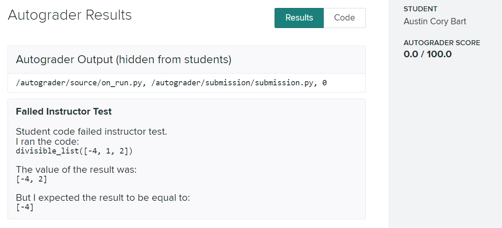

.. _integrations:

Autograder Integrations
=======================

Pedal is not tied to a single autograding platform, our vision is that it should be usable anywhere. This
is largely achieved through "environments", which can be set as command line parameters to reconfigure Pedal
for the desired autograding platform. If you want to see a new platform, then please raise an Issue on our GitHub!

GradeScope
----------

You will need to create an instructor control script (e.g., `ics.py`) and upload it along with the following files:

.. code-block:: bash
    :caption: setup.sh

    python3 -m pip install pedal
    # Or use the development version of Pedal
    # python3 -m pip install git+git://github.com/pedal-edu/pedal.git
    # We also have these additional curriculum libraries available
    # python3 -m pip install git+git://github.com/pedal-edu/curriculum-sneks.git
    # python3 -m pip install git+git://github.com/pedal-edu/curriculum-ctvt.git

.. code-block:: bash
    :caption: run_autograder

    #!/usr/bin/env bash
    # Runs the first python file that the student submitted
    files=( /autograder/submission/*.py )
    pedal grade \
            /autograder/source/ics.py \
            "${files[0]}" \
            --environment gradescope \
            --output "/autograder/results/results.json"

GradeScope
----------

You will need to create an instructor control script (e.g., `ics.py`) and upload it along with the following files:

.. code-block:: bash
    :caption: setup.sh

    python3 -m pip install pedal
    # Or use the development version of Pedal
    # python3 -m pip install git+git://github.com/pedal-edu/pedal.git
    # We also have these additional curriculum libraries available
    # python3 -m pip install git+git://github.com/pedal-edu/curriculum-sneks.git
    # python3 -m pip install git+git://github.com/pedal-edu/curriculum-ctvt.git

.. code-block:: bash
    :caption: run_autograder

    #!/usr/bin/env bash
    # Runs the first python file that the student submitted
    files=( /autograder/submission/*.py )
    pedal grade \
            /autograder/source/ics.py \
            "${files[0]}" \
            --environment gradescope \
            --output "/autograder/results/results.json"

**Basic Instructor Control Script:**

.. code-block:: python
    :caption: ics.py

    from pedal import *

    # Set the maximum score for the assignment here
    set_maximum_score(100)

    # Your grading logic here
    assert_equal(call("add", 1, 2), 3)
    
    # Use simple resolver (default) - shows only first feedback
    resolve()

**Full Resolver Example (Show All Feedback):**

Many instructors want to show all feedback to students at once, rather than just the first error. 
Use the full resolver for this:

.. code-block:: python
    :caption: ics_full_feedback.py

    from pedal import *
    from pedal.resolvers.full import resolve

    set_maximum_score(100)

    # Test multiple aspects - all feedback will be shown
    assert_equal(call("add", 1, 2), 3, message="Addition function failed")
    assert_equal(call("multiply", 3, 4), 12, message="Multiplication function failed")
    assert_output(student, "Hello World", message="Output should greet the world")
    
    # Ensure good coding practices
    ensure_function_call('print', message="You must use the print function")
    prevent_function_call('eval', message="Do not use eval() function")
    
    # Check for specific patterns
    ensure_literal(42, message="You must use the number 42 in your solution")
    
    # This will show ALL feedback that was triggered
    resolve()

**Sectional Resolver Example (Organized Feedback):**

For complex assignments with multiple parts, use the sectional resolver:

.. code-block:: python
    :caption: ics_sectional.py

    from pedal import *
    from pedal.resolvers.sectional import resolve

    set_maximum_score(100)

    # Part 1: Basic functionality (40 points)
    with section("Part 1: Basic Functions"):
        set_section_score(40)
        assert_equal(call("add", 1, 2), 3)
        assert_equal(call("subtract", 5, 3), 2)
        
    # Part 2: Advanced functionality (30 points)  
    with section("Part 2: Advanced Features"):
        set_section_score(30)
        assert_equal(call("power", 2, 3), 8)
        assert_equal(call("factorial", 5), 120)
        
    # Part 3: Output formatting (30 points)
    with section("Part 3: Output"):
        set_section_score(30)
        assert_output(student, "Results: 8, 120")
        
    # This organizes feedback by sections
    resolve()

**Advanced Scoring with Feedback:**

.. code-block:: python
    :caption: ics_advanced_scoring.py

    from pedal import *
    from pedal.resolvers.full import resolve

    set_maximum_score(100)

    # Award partial credit for attempts
    if function_exists("add"):
        give_partial(10, "Good job defining the add function")
        
        # Test the function
        result = call("add", 1, 2)
        if result == 3:
            give_partial(20, "Add function works correctly")
        else:
            give_partial(5, f"Add function returns {result}, expected 3")
    else:
        explain("You need to define an 'add' function", label="missing_add_function")

    # Deduction system example
    if "eval" in get_program():
        give_partial(-10, "Points deduced for using eval() function")
        
    # Percentage-based scoring
    if call("multiply", 3, 4) == 12:
        give_partial("20%", "Multiply function bonus")
        
    resolve()

**Multiple File Handling in GradeScope:**

.. code-block:: bash
    :caption: run_autograder_multiple_files

    #!/usr/bin/env bash
    # Handle multiple Python files
    cd /autograder/submission/
    main_file=$(find . -name "main.py" -o -name "*main*.py" | head -n 1)
    if [ -z "$main_file" ]; then
        main_file=$(ls *.py | head -n 1)
    fi
    
    pedal grade \
            /autograder/source/ics.py \
            "$main_file" \
            --environment gradescope \
            --output "/autograder/results/results.json"

.. code-block:: python
    :caption: ics_multiple_files.py

    from pedal import *
    import os
    
    set_maximum_score(100)
    
    # Verify all required files exist
    required_files = ["main.py", "helper.py", "utils.py"]
    for filename in required_files:
        if not os.path.exists(filename):
            explain(f"Missing required file: {filename}", label=f"missing_{filename}")
            
    # Load and verify each file
    for filename in required_files:
        if os.path.exists(filename):
            with open(filename, 'r') as f:
                code = f.read()
            verify(code, filename=filename)
            
    # Run helper files first, then main
    if os.path.exists("helper.py"):
        run_file("helper.py")
    if os.path.exists("utils.py"):  
        run_file("utils.py")
        
    # Now test the main functionality
    student = run()
    assert_equal(call("main_function"), "expected_result")
    
    resolve()

By default, the GradeScope environment will:

* Run both TIFA and the student's code (the first file it finds)
* Produce HTML output
* Only show the highest priority feedback message, rather than all possible feedback

If you want to run Pedal with Gradescope and only output a single (highest priority) feedback object, you can use
one of its alternative resolvers (e.g., ``single``):

.. code-block:: bash
    :caption: run_autograder

    #!/usr/bin/env bash
    # Runs the first python file that the student submitted
    files=( /autograder/submission/*.py )
    pedal grade \
            /autograder/source/ics.py \
            "${files[0]}" \
            --environment gradescope \
            --resolver single \
            --output "/autograder/results/results.json"

BlockPy
-------

BlockPy comes preloaded with Pedal. No special configuration is required!

Since the environment is preconfigured on every run, the only thing you need to do is ``from pedal import *``

VPL
---

You will need to create an instructor control script (e.g., `ics.py`), and upload it along with a `vpl_evaluate.sh` file:

.. code-block:: console
    :caption: vpl_evaluate.sh

    # Run the environment variable initializer to get access to its variables
    source ./vpl_environment.sh
    echo "#!/bin/bash" > vpl_execution
    echo "python3.6 -m pedal grade ics.py $VPL_SUBFILE0 --environment vpl">> vpl_execution
    chmod +x vpl_execution

You should configure the assignment as follows:

* Include the `ics.py` file in the "Files to keep when running"
* Under "Execution Options", enable Evaluate and Automatic Grade.

When you use the VPL environment, you can expect the following:

* Most HTML tags are not available; only headers and preformatted text blocks are available.

Web-CAT
-------

We have not tried the latest version of Pedal on Web-CAT. However, we believe that it should be possible to install
Pedal and have it generate appropriate documentation, based on our success with an earlier version. If you are
interested in this effort, please check our GitHub Issues!

Jupyter Notebooks
-----------------

Jupyter Notebook integration has been achieved, but we have not really prepared this for other people to use.
If you are interested, then you will need to make sure that the Jupyter server preloads the Grade Magic command we
have created. From there, you can create custom notebooks with the instructor grading code at the bottom. We wrote
a `simple extension <https://github.com/acbart/jn-student-toolbar>`_ to hide these cells (along with
other interface changes).